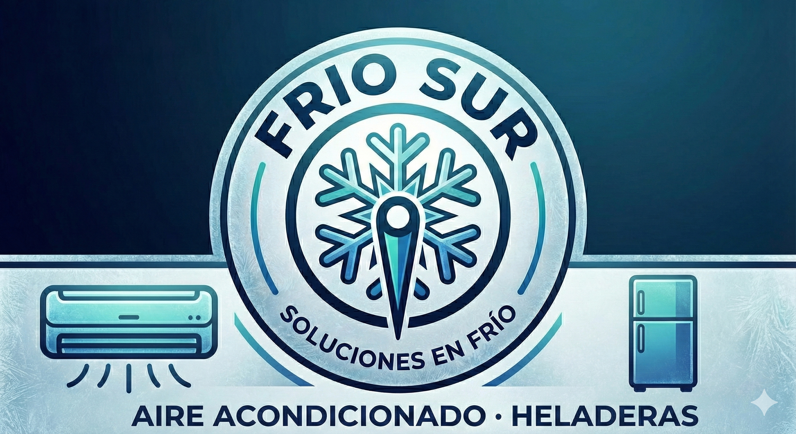

  
  <h1>FrioSur - Servicio Técnico Web</h1>
  
  

    <strong>Landing Page profesional para servicio de reparación de electrodomésticos en Zona Sur.</strong>
  

  

    
  

  

    
    
    
  

---

## 📋 Descripción

Este proyecto es el sitio web oficial de **FrioSur**, diseñado para ofrecer servicios de reparación de aires acondicionados, heladeras y lavarropas. Incluye un sistema de contacto integrado y diseño adaptable a celulares.

## ✨ Características

* 📱 **100% Responsive:** Se adapta a cualquier pantalla.
* 📨 **Formulario Funcional:** Conectado a Google Forms para recibir presupuestos al instante.
* 🖼️ **Galería Visual:** Carrusel de imágenes mostrando los servicios.
* 📍 **Info Clara:** Áreas de cobertura y contacto directo por WhatsApp.

## 🚀 Link al Proyecto

Podés visitar la web funcionando aquí:
👉 **[https://friosur-web.netlify.app/](https://friosur-web.netlify.app/)**

---

  
Desarrollado por <strong>Luciana Morel Scharf</strong>

